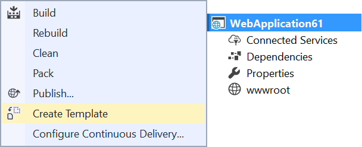
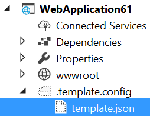
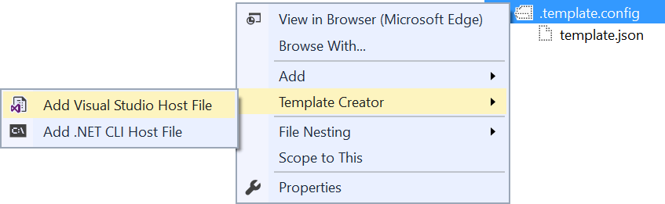

# SideWaffle Template Creator

Download this extension from the [VS Marketplace](https://marketplace.visualstudio.com/items?itemName=MadsKristensen.TemplateCreator)
or get the [CI build](http://vsixgallery.com/extension/49719076-63de-4191-8f25-470f5fb3b6cb/).

---------------------------------------

Makes it easy to create custom project templates for 'dotnet new' and Visual Studio.

See the [change log](CHANGELOG.md) for changes and road map.

Read more about the [new template format here](https://blogs.msdn.microsoft.com/dotnet/2017/04/02/how-to-create-your-own-templates-for-dotnet-new/) and how to create and customize your templates. This extension makes it easy to get started, but you need to understand how the underlying templating system works to take full advantage of it.

## Features

- Generate template file
- Add Visual Studio host file
- Add .NET CLI host file

### Generate template file
Right-click the project you want to turn into a template and click *Create Template...*.

That will create a folder called *.template.config* and add a file called *template.json* to it. The folder is not being added to the project, but exist on disk in the root of the project directory.

## Add Visual Studio/.NET CLI host files
To have the template show up in the ASP.NET project dialog, you need to add a Visual Studio specific host file to the *.template.config* folder.

To control the CLI experience using *dotnet new* you need a .NET CLI specific host file.

## Contribute
Check out the [contribution guidelines](.github/CONTRIBUTING.md)
if you want to contribute to this project.

For cloning and building this project yourself, make sure
to install the
[Extensibility Tools](https://visualstudiogallery.msdn.microsoft.com/ab39a092-1343-46e2-b0f1-6a3f91155aa6)
extension for Visual Studio which enables some features
used by this project.

## License
[Apache 2.0](LICENSE)